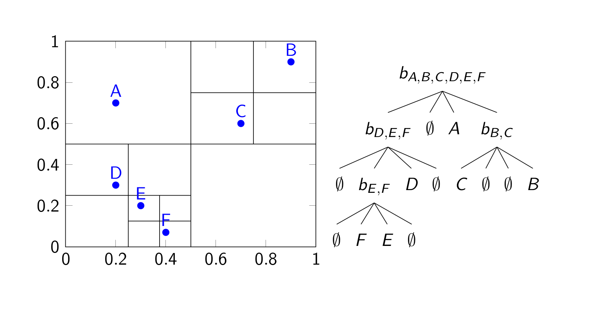
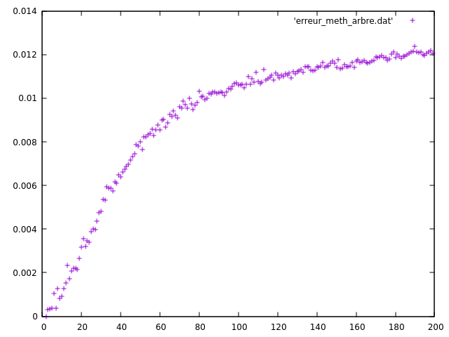
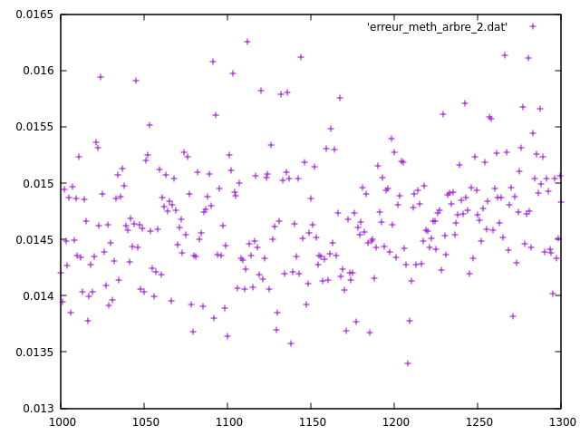
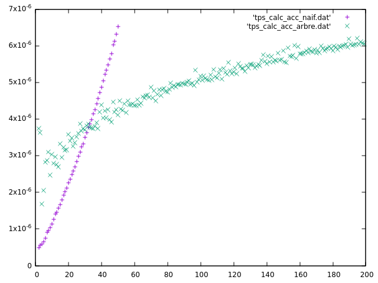
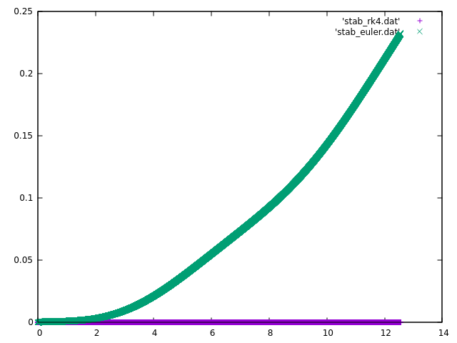

# TIPE_probleme_n_corps
TIPE sur la résolution numérique du problème à n corps

## Table des matières

1. Abstract
2. Position du problème
3. Calcul des accélérations
   1. Méthode naïve
   2. Méthode de Barnes-Hut
4. Intégration Numérique
5. Utilisation du programme

## Abstract

Given that the general solution to the *n* body problem for *n*
greater than 3 is a power series that converges so slowly it is
impossible to use, an approximate solution that is both reliable and
efficient is reaquired. That is what we aimed at finding in this TIPE.

## Position du problème

Le problème à *n* corps a d'abord été étudié par Newton, dans son
*Principia*. Bernoulli, Lagrange, Kepler, Euler, ont chacun étudié des
cas particuliers du problème à *n* corps, nommément pour *n* = 2 et *n*
= 3, et c'est Sundman qui, en 1909, donne une solution exacte,
générale, du problème à 3 corps. Le problème de cette solution est que
c'est une série entière, qui converge extrêmement lentement (plus de
10⁸⁰⁰⁰⁰⁰⁰ termes nécessaires pour avoir un décimale correcte dans un
cas de Lagrange).

Une méthode numérique efficace et sure est donc nécessaire afin de
prévoir les mouvements des objets du système solaire, des étoiles dans
leurs galaxies, des galaxies dans leurs amas, *et caetera*.

La difficulté du problème à *n* corps réside dans le calcul des
accélération. Il est facile de voir qu'un calcul naïf serait en
*O(n²)* : inutilisable dès que l'on dépasse 1000 corps.

Nous nous sommes concentrés sur la méthodes de Barnes-Hut, à base
d'arbre, qui permet de réduire le nombre de forces à calculer, pour
aboutir à une complexité temporelle *O(n* log *n)*

Une fois les accélérations calculées à un instant donné, il faut
intégrer par une méthode d'intégration numérique. L'on étudiera cette
partie par la suite.

## Calcul des accélérations

### Méthode naïve

La première méthode consiste à calculer **toutes** les forces
s'appliquant sur un corps, puis à appliquer le Principe Fondamental de
la Dynamique. Il y a donc, pour tous les *n* corps, *n* - 1 forces à
calculer. D'où une complexité en *O(n²)*.

Cette méthode naïve, bien qu'extrêmement coûteuse, est néanmoins la
seule méthode exacte dont on dispose. Toutes les méthodes plus
efficaces, comme la méthode de Barnes-Hut, sont des approximations.

### Méthode de Barnes-Hut

On peut tout d'abord remarquer que, si un corps est suffisamment
éloigné d'un groupe de corps, on peut considérer que la force qu'ils
exercent sur celui-ci est proche de la force qu'exercerait un corps
situé à leur barycentre, de masse la somme de leurs masses.

La méthode de Barnes-Hut consiste à subdiviser l'espace par un arbre,
un quadtree en dimension 2, octree en dimension 3 : chaque nœud
représente une cellule de l'espace, est d'étiquette un corps de masse
la somme des masses des corps contenus dans la cellule, situé à leur
barycentre. Si la cellule contient plus d'un corps, on subdivise
l'espace en quatre carrés (ou huit cubes), qui seront les fils du
nœud.

Cette construction permet de calculer les barycentres une seule fois
par instant de la subdivision temporelle, et de donner un critère pour
savoir si un corps est loin d'autres, et ainsi de réduire le nombre
de forces à calculer.

Le calcul de l'accélération d'un corps se fait récursivement : pour un
nœud, on calcul la rapport de la largeur de la case qu'il représente
sur la distance du corps par rapport au centre de la cellule. Si ce
rapport est plus grand qu'un paramètre *θ* donné (environ 1), on se
rappelle récursivement sur les fils. Sinon, (ou si le nœud est une
feuille) le corps est suffisamment loin de la cellule, et on calcule
la force exercée par l'étiquette du nœud sur le corps, et on ajoute
cela à un accumulateur. À la fin de l'exécution, l'accumulateur
contient une bonne approximation de la force totale exercée sur le
corps, il ne reste plus qu'à appliquer le Principe Fondamental de la
Dynamique.

<p align="center">
   
</p>

Ici par exemple, le corps *B* est suffisamment loin de *D*, *E*, et
*F* pour ne calculer que la force exercée par *b<sub>D, E,
F</sub>*. En revanche, C est plus proche de cette cellule, on
s'appellera donc récursivement sur les cellules contenant *D*, et *E*
et *F*.

On peut tout d'abord voir que cette approximation est correcte :
ci-dessous les écarts relatifs pour *θ* = 0.5


<p align="center">
   
</p>


<p align="center">
   
</p>


On ne dépasse pas les 1,6 % d'écart relatif, ce qui est très bon.

On peut aussi se demander si cette méthode est bien plus efficace que
la méthode naïve.

On peut voir que la construction de l'arbre, et le calcul des
accélérations sont tous deux **en moyenne** en *O(n* log *n)*.

##### Construction de l'arbre

Pour chaque nœud : linéaire en le nombre de corps dans la cellule.
On a alors un *O(h\*n)*, où *h* est la hauteur de l'arbre, en moyenne
log(*n*), quand l'arbre est équilibré, *i.e.* quand les corps sont
bien répartis dans l'espace.

##### Calcul des accélérations

Pour chaque corps, on ne calcule qu'un nombre fini de forces par
niveau de profondeur de l'arbre : *O(h)* = *O(* log *n)* en
moyenne. D'où la complexité totale voulue.

Ci-dessous les graphes des temps moyens de calcul des accélérations par
corps (*i.e. t(n)/n*), par la méthode naïve et par la méthode de Barnes-Hut.

<p align="center">
   
</p>

On constate que le temps de calcul est effectivement bien inférieur
par la méthode de Barnes-Hut.

Maintenant qu'on dispose d'une méthode efficace et correcte pour
calculer les accélérations pour des positions données, on peut
utiliser des méthodes d'intégration numériques classiques.

## Intégration numérique

On écrit tout d'abord le système sous forme matricielle *Y' = f(t, Y)*

La première idée est d'utiliser la méthode d'Euler. Simple à mettre en
œuvre, rapide... Mais c'est une méthode d'ordre 1 : elle
est stable (l'erreur sur la solution est majorée par une constante
multipliée par l'erreur sur la condition initiale) pour les polynômes
de degré au plus 1. Cela implique également que l'erreur sur la
solution est en *O(h)*, où *h* est le pas de temps. Nous verrons que
cela entraîne d'importantes erreurs d'approximations, surtout sur des
équations raides (où alors elle n'est plus stable).

Nous allons ensuite implémenter la méthode de Runge-Kutta dite
« *classique* », d'ordre 4 (d'où une erreur en *O(h⁴)*), ce qui assure
une stabilité beaucoup plus importante. Bien que plus coûteuse que la
méthode d'Euler (quatre appel à *f* par point de la subdivision), la
complexité asymptotique de la méthode ne change pas.

On pourrait implémenter par la suite des méthodes de Runge-Kutta
implicites, ou à pas contrôlé, mais cela augmenterait de beaucoup le
temps de calcul, *RK4* suffit dans la plupart des cas.

Voici un graphe, pour une solution périodique à quatre corps, de
l'écart relatif de la position par rapport à la position théorique en
fonction du temps.

<p align="center">
   
</p>


On voit facilement que, alors que la méthode de Runge-Kutta classique
reste stable, les positions renvoyées par la méthode d'Euler
s'écartent sensiblement des positions théoriques, ce qui est
inacceptable en pratique.

## Utilisation du programme


Un fichier exécutable est fourni dans ce dépôt: `plot`

Ce fichier est compilé en exécutant

```
$ make plot
```

depuis ce dossier.

Ce programme permet d'afficher un graphe de la trajectoire
de corps (en 2 dimensions), à partir de conditions initiales
données, avec une méthode d'intégration donnée, une méthode de
calcul des accélérations données, une durée et un temps donné.

Syntaxe :

```
$ ./plot help 
```
	
affiche cette aide

```
$ ./plot ki ka i t h theta
```
	
ki est 0 ou 1, 0 pour la méthode d'Euler, 1 pour RK4

ka est 0 ou 1, 0 pour le calcul naïf, 1 pour Barnes-Hut avec
le paramètre theta, un flottant, 1.0 par défaut

i est un entier, indique au programme de lire le fichier
"condi.dat" pour les conditions initiales. Trois fichiers
sont fournis : "cond0.dat", "cond1.dat" et
"cond2.dat". Se référer au README.md pour le formattage des
fichiers de conditions initiales.

t est la durée, un flottant

h est le pas de temps, un flottant.


Le programme crée alors plusieurs fichiers : 

"icorpsk.dat" pour k allant de 1 à n, si "condi.dat"
contient n corps, contenant les positions successives du
corps k

"plot_cond_ini_i.plot", un fichier lisible par gnuplot
par exemple, permettant de tracer les trajectoires.